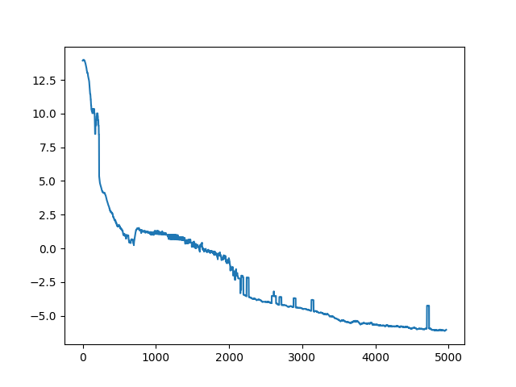

## Motivation

Azure VMs run on 60% renewable energy. However, usage fluctuates throughout the day. We could assume that due to fluctuations in renewable energy generation and server usage, during some parts of the day an Azure datacentre might be entirely run on renewable energy, while at other times it may be far less than 60% usage.

Therefore, it would be more sustainable to run computation that is not time critical at off-peak hours. For example, we could do this with Enzyme's sanitisation component.

However, there may be uncertainty about the availability of spot VMs (if these are being used) and how much data we will need to process. This presents an interesting challenge to get the right tradeoff between running off peak and making sure all the computation can be done.

This project is about writing a Reinforcement Learning agent to decide how many VMs to run in order to maximise the environmental savings while still getting all the work done.

## Implementation

We use a simulation rather than live spot VMs to train the agent.

Input data:
    - data to process
    - data processed
    - time of day (hour / 24)
    - if it is the end of the day (to make it easier to predict final reward)
    - VM availability right now
    - VM availability so far (cumulative)
    - current number of VMs being used

Reward: (α * #VM * minutes on peak) + (β * #VM * minutes off peak) + (γ if data is processed by the end of the day)

Used some kind of approximate monte carlo method with episodes split into discrete days.

## Running

Device is currently set to CPU so it should be possible to run after pip installing requirements.txt. Run with:
```
python src/main.py
```
You should expect to see an output similar to:
```
constructing model
constructing environment
training model
  3%|▉                                    | 130/5000 [00:04<04:14, 19.14it/s]
```

## Results

Model successfully learned value function. Loss graph:



Which results in predictions from the model. Generally, the model seems pretty reluctant to hit the load targets so it may need some tweaking to become more confident with high reward when the VM processing targets are hit and a better tradeoff between sustainability and processing in the reward function.